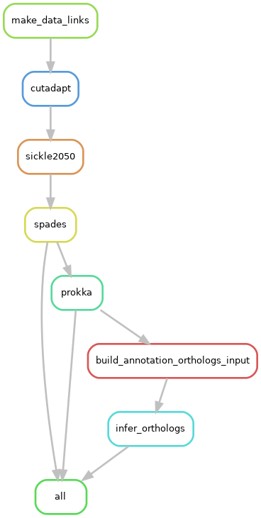
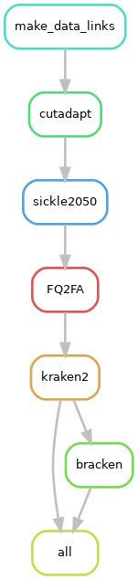

# Snakemake rules

A Snakemake rule is a step of the pipeline that can be executed, depending on what the desired outputs of the pipeline are. 

This page includes some additional context about the Snakemake rules defined in `Snakefile.py`, beyond what is already available in the comments. If applicable, links to external documentation for bioinformatics tools are included in the rule descriptions.

## Rule graph

Here is a graph summarizing how the Snakemake rules relate to each other in the workflow:

## Rule all

### `rule_all`

Purpose: This is a special Snakemake rule where the `input` is the list of `output` files you want to have at the end of the workflow.

External documentation: [snakemake](https://snakemake.readthedocs.io/en/stable/tutorial/basics.html)

## Data processing

### `make_data_links`

Purpose: Makes symbolic links to data files

Notes: 
* The python functions called by this rule (and defined in `scripts/gus_helper_functions.py`) only handle a few cases of how the FileName (in `samples.csv`) relates to the precise names for forward and reverse raw read files.

External documentation: none

### `cutadapt`

Purpose: Removes adapters from reads with cutadapt

Cutadapt flags: 
* `-a CTGTCTCTTAT` will need to change if you have a different adapter sequence.

External documentation: [cutadapt](https://cutadapt.readthedocs.io/en/stable/)

### `sickle2050`

Purpose: Trims reads based on quality with sickle

Sickle flags: 
* `pe` - paired-end reads
* `-t sanger` - specify type of quality value ([background on why this flag is `sanger` not `illumina`](https://en.wikipedia.org/wiki/FASTQ_format#Quality))
* `-q 20` - quality threshold
* `-l 20` - discard trimmed reads smaller than this length
* `-x` - do not trim from 5’ end (trim from 3’ end only)
* `-n` - truncate N (and everything after it)

External documentation: [sickle](https://github.com/najoshi/sickle)

## Mapping step

### `refGenome_index`

Purpose: Indexes reference genome for bowtie2

External documentation: [bowtie2](https://bowtie-bio.sourceforge.net/bowtie2/manual.shtml)

### `bowtie2`

Purpose: Aligns reads to the reference genome with bowtie2

Bowtie2 flags: 
* `-X 2000` - minimum fragment length for valid paired-end alignment
* `--no-mixed` - no alignments for individual mates
* `--dovetail` - allow mates to extend past each other
* `--no-unal` - suppress SAM records for reads that failed to align
* Default alignment parameters are available in Bowtie2 documentation

External documentation: [bowtie2](https://bowtie-bio.sourceforge.net/bowtie2/manual.shtml)

### `bowtie2qc`

Purpose: Runs a QC script to summarize results of bowtie2 mapping

External documentation: none

### `sam2bam`

Purpose: Compresses SAM file into BAM file (and removes duplicate reads)

Notes:
* Executed in a Snakemake shadow directory to avoid leftover temp files or truncated files if job is aborted unexpectedly

External documentation: [samtools](http://www.htslib.org/doc/)

### `sam2bam_cleanup`

Purpose: Deletes SAM file once BAM file is created (SAM files are very large)

Notes:
* Snakemake rule priority set high to get rid of large SAM files as fast as possible

External documentation: none

### `samtools_idx`

Purpose: Indexes reference genome for samtools

External documentation: [samtools](http://www.htslib.org/doc/)

### `mpileup2vcf`

Purpose: Processes BAM file into VCF files

Notes:
* Executed in a Snakemake shadow directory to avoid leftover temp files or truncated files if job is aborted unexpectedly

Samtools flags:
* `samtools mpileup` - produces "pileup" textual format from an alignment
	* `-q30` - minimum mapping quality for an alignment to be used
	* `-x` - turns off read-pair overlap detection and removal
	* `-s` - record mapping quality in output file
	* `-O` - output base positions on reads in orientation listed in the SAM file (left to right)
	* `-d3000` - maximum number of reads at a given position to include (skips reads over this coverage threshold)
	* `-t SP` - for Phred-scaled strand bias P-value
* `bcftools call` - SNP calling
	* `-c` - use consensus caller method
	* `-Oz` - output compressed VCF
* `bcftools view`
	* `-Oz` - output compressed VCF
	* `-v snps` - variant SNVs only
	* `-q .75` - minimum allele frequency of sites to be printed
* `tabix` - indexes position sorted files in TAB-delimited formats
	* `-p vcf` - input format for indexing

External documentation: [samtools](http://www.htslib.org/doc/)

### `vcf2quals`

Purpose: Parses VCF with python script

External documentation: none

### `pileup2diversity_matrix`

Purpose: Parses pileup with python script

External documentation: none

## Case step

### `variants2positions`

Purpose: Generates a list of candidate SNV positions for a given sample

External documentation: none

### `combine_positions_prep`

Purpose: Creates a list of files with candidate SNV positions from each sample

External documentation: none

### `candidate_mutation_table_prep`

Purpose: Build input for candidate_mutation_table

External documentation: none

### `combine_positions`

Purpose: Generates a list of candidate SNV positions based on candidate SNV positions across ingroup samples

Notes: 
* Ignores variant positions in samples marked as outgroups

External documentation: none

### `candidate_mutation_table`

Purpose: Builds candidate mutation table (stats across candidate SNV positions)

Notes: 
* Option to build raw coverage matrix and normalized coverage matrix
* See [this page](readme_snake_run.md) for a description of data objects generated

External documentation: none

## Assembly (alternative workflow)

The assembly workflow generates annotated assemblies for each sample. Below is a description of snakemake rules specific to the assembly step (excluding the data processing steps already described [above](#data_processing)).

### Rule graph

### `spades`

Purpose: Assemble a genome from reads from a given sample using SPAdes

SPAdes flags:
* `-m 500` - memory limit in GB
* `-k 21,33,55,77` - k-mer lengths
* `--phred-offset 33` - PHRED quality offset for the input reads
* `--careful` - tries to reduce the number of mismatches and short indels

External documentation: [SPAdes](https://github.com/ablab/spades)

### `prokka`

Purpose: Annotate assembly using prokka

Prokka flags:
* `--compliant` - force Genbank/ENA/DDJB compliance
* `--force` - force overwriting existing output folder

External documentation: [prokka](https://github.com/tseemann/prokka)

### `build_annotation_orthologs_input`

Purpose: Get two-column (caldeID,path2faa) input file for ortholog_inference script

External documentation: none

### `infer_orthologs`

Purpose: Infer ortholog info for each identified gene (based on AA sequence) across all clades using CD-HIT

CD-HIT flags: 
* `percent_identity="0.9"` - percent identity threshold for clustering AA sequences

External documentation: [CD-HIT](https://sites.google.com/view/cd-hit)

## Bracken (alternative workflow)

The bracken workflow generates estimates of taxonomic abundance for each sample. Below is a description of snakemake rules specific to the assembly step (excluding the data processing steps already described [above](#data_processing)).

### Rule graph

### `FQ2FA`

Purpose: Turn fastq files into fasta files

External documentation: none

### `kraken2`

Purpose: Run kraken (on forward read file only)

Notes: 
* The kraken database should be updated occasionally.

External documentation: [Kraken2](https://github.com/DerrickWood/kraken2/wiki/Manual)

### `bracken`

Purpose: Run bracken

External documentation: [Bracken](https://github.com/jenniferlu717/Bracken)

## Table of contents

[Main Lieberman Lab pipeline README](../README.md)
* [Snakemake pipeline](readme_snake_main.md)
	* [How to run the snakemake pipeline](readme_snake_run.md)
	* [Technical details about the snakemake pipeline](readme_snake_rules.md)
	* [Wishlist for snakemake pipeline upgrades](readme_snake_wishlist.md)
	* [Helpful hints for using the command line](readme_snake_basics.md)
* [Local analysis](readme_local_main.md)
	* [How to run the local analysis script](readme_local_run.md)
	* [Wishlist for local analysis upgrades](readme_local_wishlist.md)
	* [Python best practices](readme_local_best.md)

