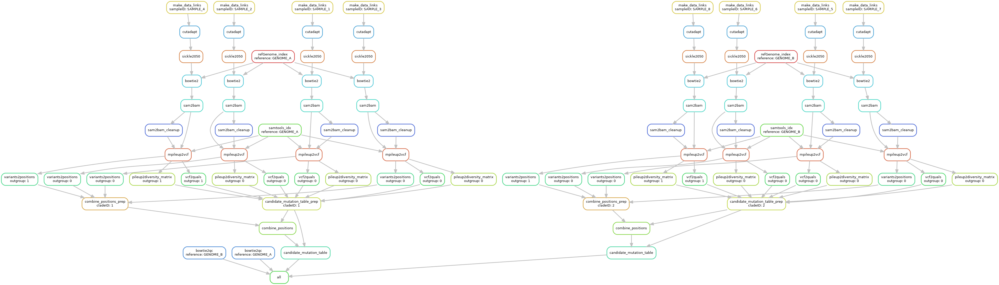

# How to run the Snakemake pipeline


## Outline

This page describes the steps you should take to run the Snakemake pipeline, which processes raw sequencing reads (removes adapters and trims reads based on quality), aligns reads to a reference genome, identifies candidate SNV positions, and saves data arrays with stats on the alignment of each sample at each candidate SNV position. 


## A very brief intro to Snakemake 

If you have not used Snakemake before, please [watch this brief intro video](https://www.youtube.com/watch?v=UOKxta3061g) and refer to the [official Snakemake documentation](https://snakemake.readthedocs.io/en/stable/) for more information. It will be helpful if you familiarize yourself with the concepts of Snakemake rules, wildcards, and DAGs before proceeding. In brief:
* A *rule* is a small steps that specifies how to create sets of output files from sets of input files. A rule will often employ a specific bioinformatics tool (e.g. bowtie2 for alignment of reads to a reference genome). 
* A *wildcard* is used to generalize a rule to be applicable to a number of datasets. For example, if the same rule will be executed once for each sample, you might use a sample name wildcard when defining input and output files for that rule.
* A *DAG (directed acyclic graph)* refers to the type of flowchart used by Snakemake to determine which rules need to be executed on which files to get from your set of input files to your set of output files. The nodes are rules and the edges are input/output files.


## 1. Modify the necessary input files


### Copy the template Snakemake directory

All necessary files are available in `snakemake_pipeline/` and are described below:
* `snakemake_pipeline/samples.csv` - csv file with one row per sample
* `snakemake_pipeline/experiment_info.yaml` - definded filepaths and variables relevant to this experiment
* `snakemake_pipeline/Snakefile.py` - Snakemake workflow
* `snakemake_pipeline/run_snakemake.slurm` - script for batching the Snakemake workflow to a Slurm cluster
* `snakemake_pipeline/config.yaml` - information on cluster parameters and what computing resources are required by different workflow steps
* `snakemake_pipeline/scripts/` - scripts called by snakemake
* `snakemake_pipeline/envs/` - conda environments used by snakemake

Make a copy of all of these files and directories in the directory on the cluster in which you wish to run the Snakemake workflow.


### Modify files for your project

Some of the files in the template directory must be modified according to the guidelines below.

#### `snakemake_pipeline/input/samples.csv`

Mandatory changes:
* Fill in the csv with one row per sample and populate all columns
	* Path: the path to the directory where your raw data files are located
		* If you sequenced your sample more than once, then you can list directories to your sequencing data separated by spaces, e.g. "/path/to/seq/run/1/ /path/to/seq/run/2/". Note that the FileName in each directory must be the same.
	* Sample: the name of the sample
		* Constraints: Sample names must be unique
	* FileName: the name of the raw data file for the sample without the file extension and without part of the filename that indicates fwd/rev reads 
		* Example: if your data fwd+rev files are "MySampleBarcode_R2.fq.gz" and "MySampleBarcode_R2.fq.gz", then you should put "MySampleBarcode" as the FileName).
		* Constraints: Raw data files must already be demultiplexed. There must be a file with forward reads and another file with reverse reads (paired end sequencing only).
	* Reference: the name of the reference genome(s) to which Snakemake should align your sample
		* Constraints: The reference genome name must correspond to the name of a directory with a file called "genome.fasta".
	* Group: a string that indicates which samples should be analyzed together
		* The Snakemake workflow will identify candidate SNVs that differentiate samples within the same group. One candidate mutation table will be produced for each group.
		* Constraints: Entry must be a string with no spaces or forbidden characters. All samples in the same group must be aligned to the same reference genome.
	* Outgroup: a boolean value indicating whether or not your sample is an outgroup sample
		* The Snakemake workflow will only identify candidate SNVs that differentiate ingroup samples from each other. It will NOT identify candidate SNVs that differentiate only ingroup samples from outgroup samples.
		* Constraints: Entry must be "0" or "1".

#### `snakemake_pipeline/input/experiment_info.yaml`
Mandatory changes:
* change sample_table to path to samples.csv
* change myscripts_directory to path to "/scripts" folder in this directory

* change experiment_name, ref_genome_directory if needed

#### `snakemake_pipeline/config.yaml`
NOTE: this file may not be renamed

Mandatory changes:
* Put your own email in line `"mail-user":"YOUR_EMAIL_HERE",`
* change configfile to point to experiment_config.yaml for this experiment
* change mkdir, --output and --error to point to log folder for this experiment

Optional changes:
* Modify the list of nodes to exclude in line `"exclude":"node327,node088",`. 
* Change dry-run or unlock parameters if desired 
* Change rule resource requirements

#### `snakemake_pipeline/Snakefile.py` 

Mandatory changes:
* Check to make sure the variable `flag` is set to `"all"`. 

Optional changes:
* If you would like to generate raw coverage matrices (in addition to a candidate mutation table), then:
	* uncomment the line `input_all.append(expand("2-Case/candidate_mutation_table/group_{cladeID}_coverage_matrix_raw.pickle.gz",cladeID=UNIQ_GROUP_ls))` 
	* modify the rule `candidate_mutation_table` (see comments in `Snakefile.py`)
* If you would like to generage both raw and normalized coverage matrices, then: 
	* uncomment the line `input_all.append(expand("2-Case/candidate_mutation_table/group_{cladeID}_coverage_matrix_norm.pickle.gz",cladeID=UNIQ_GROUP_ls))`
	* modify the rule `candidate_mutation_table` (see comments in `Snakefile.py`)

#### `snakemake_pipeline/run_snakemake.slurm` 

Mandatory changes:
* Put your own email in line `#SBATCH --mail-user=YOUR_EMAIL_HERE`
* If your snakemake environment is not called `snakemake`, then modify line `source activate snakemake`. 

Optional changes:
* Modify the list of nodes to exclude in line `#SBATCH --exclude=node327`. Nodes can be separated by commas, e.g. `node062,node327,node304`. This is only necessary if there are problematic nodes on the cluster that you wish to avoid.

## 2. Install conda and Snakemake

### Installing conda

Conda is a package management system and environment management system. The Snakemake workflow uses conda to manage bioinformatics tools and python packages needed to execute Snakemake rules.

Follow the instructions [here](https://conda.io/projects/conda/en/latest/user-guide/install/index.html) for installing Miniconda.

### Installing Snakemake into a conda environment

Follow the instructions [here](https://snakemake.readthedocs.io/en/stable/getting_started/installation.html) for installing Snakemake with mamba. This will install mamba into your base environment and then create a new conda environment called `snakemake` containing Snakemake and its dependencies. 

Before moving on, be sure to activate your Snakemake environment (`conda activate snakemake`). 


## 3. Run Snakemake

### Run a dry run

A dryrun will catch any issues with incorrect file paths, missing input files, or improper syntax in your Snakefile. A successful dryrun will print out a list of which Snakemake rules will be executed and how many times each one will need to be executed (e.g. the rule `cutadapt` will be executed N times where N is the number of samples you put in `samples.csv`)

You can perform a dryrun by typing `snakemake -s Snakefile.py -n -p -c1` into the terminal. Be sure that you are in your Snakemake working directory (the same directory that contains `Snakefile.py`) when you do this. The output should include a tally of how many times each Snakemake rule will be executed. Here is an example job tally where there are 8 samples, 4 of which are aligned to one reference genome and the other 4 of which are aligned to another reference genome:

```
Job stats:
job                              count    min threads    max threads
-----------------------------  -------  -------------  -------------
all                                  1              1              1
bowtie2                              8              1              1
bowtie2qc                            2              1              1
candidate_mutation_table             2              1              1
candidate_mutation_table_prep        2              1              1
combine_positions                    2              1              1
combine_positions_prep               2              1              1
cutadapt                             8              1              1
make_data_links                      8              1              1
mpileup2vcf                          8              1              1
pileup2diversity_matrix              8              1              1
refGenome_index                      2              1              1
sam2bam                              8              1              1
sam2bam_cleanup                      8              1              1
samtools_idx                         2              1              1
sickle2050                           8              1              1
variants2positions                   8              1              1
vcf2quals                            8              1              1
total                               95              1              1

This was a dry-run (flag -n). The order of jobs does not reflect the order of execution.
```

You can also generate a DAG to visualize the Snakemake workflow (`snakemake -s Snakefile.py --dag | dot -Tpdf > dag.pdf`). It should look something like this:




### Batch the Snakemake workflow to the cluster

To batch the Snakemake workflow to the cluster, type `sbatch myjob.slurm` into the terminal.

### Track progress

You can the workflow's progress in the main log file, `mainout.txt` (this file is defined in `myjob.slurm` and will catch both stdout and stderr). We recommend `tail -f mainout.txt` if you want to follow along.

### Troubleshooting 

To find jobs that have failed, you can read the main log file `mainout.txt` and scan for error messages. Alternatively, you can print a list of jobs that have failed in the terminal (`sacct | grep FAILED` for failed jobs and `sacct | grep TIMEOUT` for jobs that have timed out). 

To check out the log file for a failed job:
1. type `cd logs` into the terminal, which will bring you to the `/logs` subdirectory
2. type `ls | grep JOB_ID` into the terminal, which will print the name of the log file that contains the job ID
3. type `less LOG_FILE_NAME` into the terminal, which will show you the log file contents including any error messages (type `q` to escape back to the terminal when you are done reading)
4. type `cd ..` into the terminal. 

If you find that jobs are failing because they ran out of compute resources, then you can change the resource requests in `cluster.slurm.json`.


## 4. Download data arrays

Once your Snakemake workflow is completed, you can download the output files for local analysis.

### Output files

Here is a summary of each output file created by this Snakemake workflow:
* `1-Mapping/bowtie2_qc/alignment_stats_ref_{references}.csv`
	* Summary of alignment stats 
	* One file per reference genome
	* Interpreatation: The vast majority of reads from your isolates (>95%) should align to your reference genome. Contamination will cause some isolates to have lower alignment rates. An inappropriate choice or reference genome will cause samples in general to have lower alignment rates. 
* `2-Case/candidate_mutation_table/group_{groupID}_candidate_mutation_table.pickle.gz` 
	* Candidate SNV positions along with alignment stats at each position for each sample
	* One file per Group in `samples.csv`
	* Data objects include:
		* `SampleNames` - numpy array of sample names (strings)
			* Dimensions: (number of samples)
		* `p` - numpy array of positions on the genome with candidate SNVs
			* Dimensions: (number of candidate SNV positions)
		* `counts` - numpy array of the number of fwd and rev reads representing each nucleotide at each position for each sample
			* Dimensions: (number of samples) x (number of candidate SNV positions) x 8
		* `Quals` - numpy array of the quality scores at each position for each sample
			* Dimensions: (number of samples) x (number of candidate SNV positions)
		* `in_outgroup` - numpy array of boolean representing if each sample was an outgroup sample
			* Dimensions: (number of samples)
		* `indel_counter` - numpy array of statistics on the number of reads supporting insertions and deletions at each position for each sample
			* Dimensions: (number of samples) x (number of candidate SNV positions) x 2

IMPORTANT NOTE: The above summary represents what these data objects will look like once the output of the Snakemake step is harmonized with the expected inputs of the local analysis step. This has not been updated yet--see [Wishlist for snakemake pipeline upgrades](readme_snake_wishlist.md). The names of the objects are the same, but some of the types and dimensions are different. You can convert them into the right types/dimensions with a quick function at the beginning of the local analysis script. 

If you modified `Snakefile.py` to generate coverage matrices, you will get additional output files:
* `2-Case/candidate_mutation_table/group_{cladeID}_coverage_matrix_raw.pickle.gz`
	* A coverage matrix with raw read coverage 
	* Dimensions: (number of samples) x (number of positions on genome)
* `2-Case/candidate_mutation_table/group_{cladeID}_coverage_matrix_norm.pickle.gz`
	* A coverage matrix with normalized read coverage 
	* Dimensions: (number of samples) x (number of positions on genome)
	* Please note that coverage matrices are often big files.


## Alternative Snakemake workflows

The Snakefile provided here can execute alternative workflows, outlined briefly below.

### Assembly workflow

The assembly workflow generates annotated assemblies for each sample.

How to run:
* Change the `flag` variable in `Snakefile.py` to `"assembly"`
* Necessary  fields in `samples.csv`: Path,Sample,FileName,Reference (Reference will not actually be used)

### Taxonomic abundance workflow

The taxonomic abundance workflow generates estimates abundances by taxa in each sample.

How to run:
* Change the `flag` variable in `Snakefile.py` to `"bracken"`
* Necessary  fields in `samples.csv`: Path,Sample,FileName,Reference (Reference will not actually be used)


## Table of contents

[Main Lieberman Lab pipeline README](../README.md)
* [Snakemake pipeline](readme_snake_main.md)
	* [How to run the snakemake pipeline](readme_snake_run.md)
	* [Technical details about the snakemake pipeline](readme_snake_rules.md)
	* [Wishlist for snakemake pipeline upgrades](readme_snake_wishlist.md)
	* [Helpful hints for using the command line](readme_snake_basics.md)
* [Local analysis](readme_local_main.md)
	* [How to run the local analysis script](readme_local_run.md)
	* [Wishlist for local analysis upgrades](readme_local_wishlist.md)
	* [Python best practices](readme_local_best.md)

